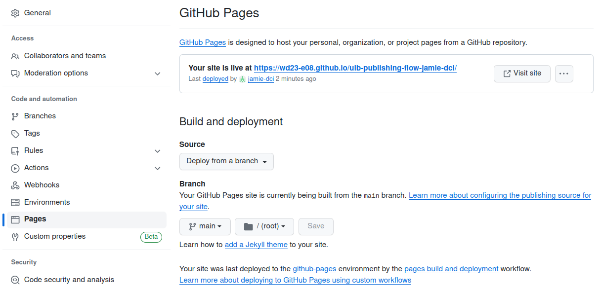

# Publishing Workflow

Let's make our work public to share it with the world. Use this power wisely and **within legal laws & regulations**!

We can use Github's service **Github Pages** to publish content of repositories to a publicly accessible URL in the shape of https://accountname.github.io/repositoryname/. 

## Instructions

1. Create an `index.html` file in this repo as a starting point and fill it with some boilerplate code (e.g. a first level heading `<h1>Hello public world</h1>`). Add, commit and push your changes.

2. Go to GitHub and enable GitHub Pages for this repository.
    * In your remote repo on GitHub, see the **Settings** tab. On the left navigate to the sub menu **Pages**
    * In the **Branch** section, select your `main` branch as the source and click the `Save` button
    * When your public page is live, GitHub will show the URL next to a `Visit Site` button. The URL will look like https://accountname.github.io/repositoryname/

3. Visit your public URL and check if everything works like it should.

4. If everything is working, send Jamie the public URL on Slack, and then feel free to continue with your individual project. :smile:

[//]: # (autograding info start)
#  Results
> ⌛ Give it a minute. As long as you see the orange dot  on top, CodeBuddy is still processing. Refresh this page to see it's current status.
>
> This is what CodeBuddy found when running your code. It is to show you what you have achieved and to give you hints on how to complete the exercise.

### Page

|                 Status                  | Check                                                                                    |
| :-------------------------------------: | :--------------------------------------------------------------------------------------- |
|  | `index.html` file exists and contains `h1` element |

### Publishing

|                 Status                  | Check                                                                                    |
| :-------------------------------------: | :--------------------------------------------------------------------------------------- |
|  | This repository is published on GitHub pages |

[🔬 Results Details](../../actions)
[🐞 Tips on Debugging](https://github.com/DCI-EdTech/autograding-setup/wiki/How-to-work-with-CodeBuddy)
[📢 Report Problem](https://docs.google.com/forms/d/e/1FAIpQLSfS8wPh6bCMTLF2wmjiE5_UhPiOEnubEwwPLN_M8zTCjx5qbg/viewform?usp=pp_url&entry.652569746=UIB-publishing-flow)

[//]: # (autograding info end)